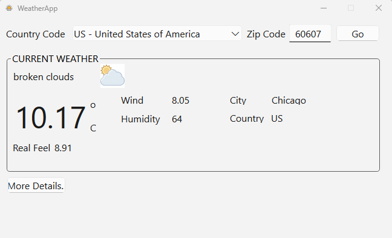

# WeatherWise - Weather App

WeatherWise is a weather forecasting application built using the **Qt** framework for the graphical user interface (GUI) and **C++** for the backend. This project provides an easy-to-use interface to get the current weather details of any country or zip code. It uses an external API to fetch weather data and displays it in a user-friendly manner.

## Features

- Fetches real-time weather data for any country or zip code.
- Clean, responsive UI built with **Qt** and **XML** for frontend development.
- Modular C++ backend for easy modification and application in other organizations or projects.
- Simple and intuitive user interface with the ability to view weather information.
- Includes a UI mockup image (`weather.png`) for visual reference of the application.

## Technologies Used

- **Qt**: A C++ framework used for building the GUI.
- **C++**: Used for the backend and API integration.
- **XML**: Used for structuring the frontend components.
- **Weather API**: An external API to fetch weather data based on user input (country/zip).

## Setup Instructions

### Prerequisites

- Ensure that you have **Qt** installed. You can download it from the official [Qt website](https://www.qt.io/download).
- Make sure you have a C++ compiler set up on your machine.

### Clone the Repository

1. Clone the repository to your local machine:

   ```bash
   git clone https://github.com/ChaosKingNV/WeatherWise
   cd WeatherWise
   ```
## Running the App
Upon running the app, you will see a clean, minimalistic GUI displaying the weather information.

1. Enter the country name or zip code in the input field.
2. The app will fetch the current weather details and display them, including:
   - Temperature
   - Humidity
   - Wind Speed

## Code Structure
The code is modular and consists of the following parts:

### Frontend (Qt/UI):
- `mainwindow.ui`: The layout file for the GUI.
- `mainwindow.cpp`: The implementation of the main window and UI logic.
- `weather.xml`: The XML configuration for frontend components.

### Backend (C++):
- `weatherapi.cpp`: The logic for making API requests and parsing responses.
- `weatherdata.cpp`: Defines the data structure for holding weather details.
- `weather.cpp`: Manages the interaction with the weather API.

## Customization
The project is designed to be easily customizable for other organizations or use cases. The modular code structure allows you to:
- Replace or modify the API to fetch weather data from another service.
- Adjust the UI components to match different branding or style guidelines.

## UI Preview
Here is a preview of the application UI:

